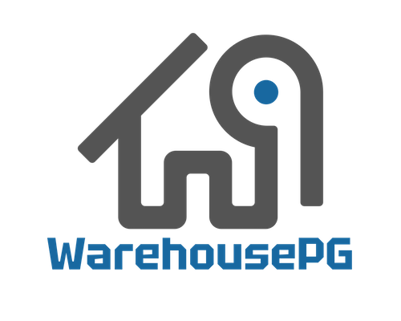

# Welcome to the WarehousePG Project!

    

WarehousePG (WHPG) is an advanced, fully featured, open
source data warehouse, based on Greenplum® Database and PostgreSQL. 
WarehousePG provides powerful and rapid analytics on
petabyte scale data volumes. Uniquely geared toward big data
analytics, WarehousePG is powered by the world’s most advanced
cost-based query optimizer delivering high analytical query
performance on large data volumes.

The [Greenplum Database OSS project](https://github.com/greenplum-db/gpdb-archive) was released under the [Apache 2
license](https://github.com/greenplum-db/gpdb-archive/blob/main/LICENSE) and went closed source in May 2024.

## Disclaimer
Greenplum® is a registered trademark of Broadcom Inc. 
EDB and EDB Postgres AI are not affiliated with, endorsed by, or sponsored by Broadcom Inc. 
Any references to Greenplum are for comparative, educational, and interoperability purposes only.

## Table of Contents
- [Source Code Provenance](PROVENANCE.md)
- [Code of Conduct](CODE-OF-CONDUCT.md)
- [Contributing](CONTRIBUTING.md)
- [License](LICENSE)

## Contributing

WarehousePG is maintained by a core team of developers with commit rights to the
[main WHPG repository](https://github.com/warehouse-pg/warehouse-pg) on GitHub. At the
same time, we are very eager to receive contributions from anybody in the wider
WarehousePG community. This section covers all you need to know if you want to see
your code or documentation changes be added to WarehousePG and appear in the
future releases.

## Getting started

WarehousePG is developed on GitHub, and anybody wishing to contribute to it will
have to [have a GitHub account](https://github.com/signup/free) and be familiar
with [Git tools and workflow](https://wiki.postgresql.org/wiki/Working_with_Git).

Once you have your GitHub account, [fork](https://github.com/warehouse-pg/warehouse-pg/fork)
this repository so that you can have your private copy to start hacking on and to
use as source of pull requests.
